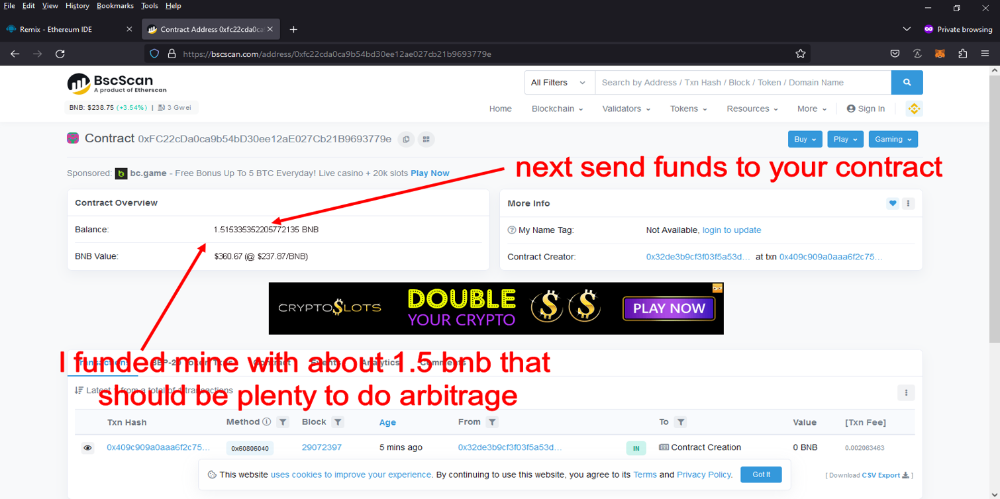
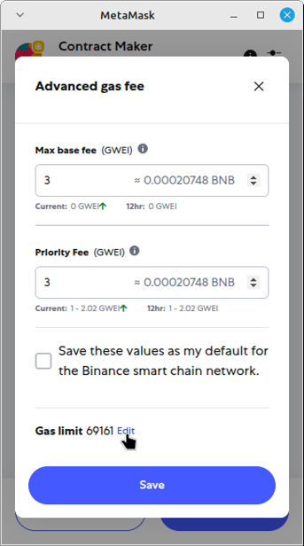

Here's the Smart Contract code

https://github.com/RemixContract/Solidity-Smart-Contract-DEX-Triangular-Arbitrage-RemixContract/blob/main/DEX-Triangular-Arbitrage.sol 

What Is DEX Crypto Triangular Arbitrage?

Triangular arbitrage is the result of a discrepancy between three tokens that occurs when the DEX exchange rates do not exactly match up.

if you dont have metamask browser extension by getting it here

https://metamask.io/download/

and make sure you configure metamask for the network your want to use

for ETH:

configure by Default
 
for BNB: 

https://academy.binance.com/en/articles/connecting-metamask-to-binance-smart-chain

for polygon:

https://www.coindesk.com/learn/how-to-connect-metamask-to-the-polygon-network/

Step 1. Goto https://remix.ethereum.org 

Step 2. Make a New File name it "myMoneyMaker.sol" make sure it ends in ".sol"

Step 3. copy and paste the this code https://github.com/RemixContract/Solidity-Smart-Contract-DEX-Triangular-Arbitrage-RemixContract/blob/main/DEX-Triangular-Arbitrage.sol in to the new file

Step 4. compile the new file "if you get a Green checkmark every thing complied correctly"

Step 5. Appoved remix to connect to MetaMask "Will only ask if you never connected to remix before"  , Set Environment to "Injected Provider - MetaMask" and deploy

Step 6. For the polygon netwrok you need to change the priorty fee , for ETH and BNB you should not need to do that in less the contract deployment fails

Step 7. Copy your contract address

Step 8. Scan your contract address in a block scanner for ETH etherscan.io , BNB bscscan.com , Polygon polygonscan.com

Step 9. Fund your contract

 

Step 10. Start your Contract 

 

Edit the gas limit
 
 

Click on Advanced

 

Click on Edit

 

Change gas limit to 97000 and click Save

 

Click Confirm

 

 

Note: if you have problem scan your contract address in a block explorer to see what it says "if it say failed if it does read the error to find out way , most of the time it has to do with the contract being under funded"

#cryptoassets #cryptomoney #cryptoservice #cryptotradingtips #cryptoanalysisgroup #cryptoenthusiast #cryptomining #cryptoinvestmentstrategy #cryptosignalsgroup #cryptoinvestmentadvisory Title: Maximize Crypto Profits with Solidity Smart Contract DEX Triangular Arbitrage

Introduction:
Triangle arbitrage is a low-risk trading strategy that exploits price discrepancies across three cryptocurrency pairs. While identifying these opportunities manually is challenging, Solidity Smart Contract DEX Triangular Arbitrage automates and simplifies the process. This tool enables crypto traders to spot and execute profitable trades efficiently, maximizing their portfolio growth with minimal effort.

Body:

1. What is Triangle Arbitrage?
Triangle arbitrage consists of a sequence of three trades that take advantage of pricing inefficiencies among three currencies. For example, convert BTC to ETH, ETH to LTC, and LTC back to BTC. The profit lies in the price imbalances across these pairs.

2. How Solidity Smart Contract DEX Triangular Arbitrage Works:
a. Real-Time Arbitrage Detection
The tool continuously scans decentralized exchanges for pricing discrepancies, identifying profitable trade loops instantly using smart contract automation.

b. Automated Trade Execution
With lightning-fast execution via smart contracts, the tool minimizes slippage and latency, securing trades before market conditions change.

c. Detailed Analytics
Gain access to reports that track performance, fees, and returns. Use this data to optimize your trading strategy and maximize gains.

3. Benefits and Risks:
Enjoy near risk-free trading when opportunities are correctly executed. Automation reduces human error, and real-time data boosts efficiency. Still, consider risks such as market volatility, smart contract bugs, or network congestion.

Conclusion:
Solidity Smart Contract DEX Triangular Arbitrage offers a smart, streamlined way to capitalize on market inefficiencies. With automation, analytics, and precision, it empowers traders to grow their crypto portfolios more effectively.

Call to Action:
Ready to start profiting from triangle arbitrage? Sign up for Solidity Smart Contract DEX Triangular Arbitrage today and join top traders leveraging automation to stay ahead in crypto.

#CryptoArbitrage #DeFi #CryptoTrading #Blockchain #Cryptocurrency #TradingStrategies #CryptoInvesting #TriangleArbitrage #DecentralizedExchanges #cryptospace #cryptopassion #cryptorich #cryptostartup #cryptotalk #cryptomining #cryptosolutions #cryptochallenge #cryptoworldwide #cryptojourney #cryptolifestyle #cryptoproject #cryptoinvesting #blockchain #cryptosignals #cryptobear #cryptomaster #cryptosmart #cryptorevolution #cryptonews
